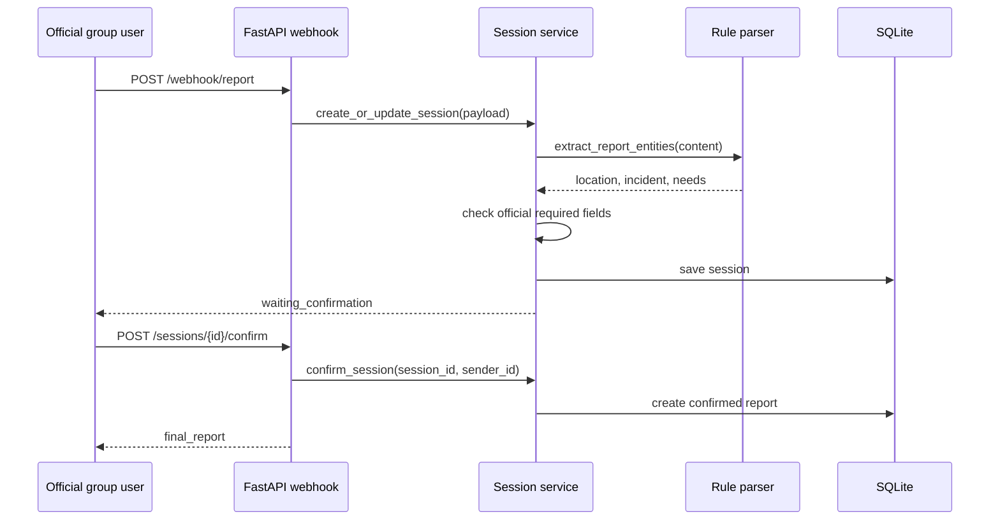
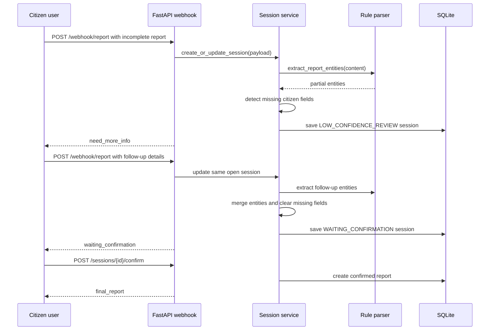

# System Architecture

## Component Diagram

```mermaid
flowchart LR
    U[User or LINE-like client] --> W[POST /webhook/report]
    W --> SS[Session Service]
    SS --> EX[Rule-based Extraction Service]
    EX --> SS
    SS --> DB[(SQLite Database)]
    SS --> RSP[Session Response]
    RSP --> U

    U --> C[POST /sessions/{id}/confirm]
    C --> SS
    SS --> RS[Reports Service]
    RS --> DB
    RS --> FR[Final Report]

    OPS[Dashboard or reviewer client] --> REP[GET /reports]
    REP --> RS
    RS --> DB
```

## Service Components

| Component | Responsibility |
| --- | --- |
| `routers/webhook.py` | Receives the main webhook-compatible report request. |
| `services/session_service.py` | Creates sessions, appends follow-up messages, computes missing fields, handles confirm/correct/cancel. |
| `services/extraction_service.py` | Applies deterministic parsing rules and merges extracted entities. |
| `services/reports_service.py` | Creates final report records and lists/updates persisted reports. |
| `models/session.py` | Pydantic request/response models and session ORM model. |
| `models/report.py` | Pydantic report response model and report ORM model. |
| `app/database.py` | SQLAlchemy database setup. |

## Official Route Flow

Official route is selected when a report has a `group_id` and contains the MVP official trigger marker in `content`.



Official required fields:

- `sender_id`
- `group_id`
- `location`
- `incident_or_needs`

## Citizen Route Flow

Citizen route is selected when the report does not meet the official route rule. Citizen reports require reporter contact fields before confirmation.



Citizen required fields:

- `sender_id`
- `location`
- `incident_or_needs`
- `reporter.name`
- `reporter.phone`

## Session State Overview

| State | Status returned | Meaning |
| --- | --- | --- |
| `RECEIVED` | `in_progress` | Initial state before missing-field evaluation. |
| `LOW_CONFIDENCE_REVIEW` | `need_more_info` | Required fields are missing; service returns a question prompt. |
| `WAITING_CONFIRMATION` | `waiting_confirmation` | Required fields are present; user can confirm, correct, or cancel. |
| `USER_CORRECTION` | `in_progress` | Reserved/open correction state in the MVP state set. |
| `EXPORTED` | `confirmed` | User confirmed; final report was created. |
| `CANCELLED` | `cancelled` | User cancelled the session. |
| `CLOSED`, `TIMEOUT`, `CONFIRMED` | final/internal | Reserved final states included in the open-session filter. |

Open-session matching:

- Same `sender_id`
- Same `platform`
- Same `group_id`, or both requests have `group_id: null`
- Current state is not final

This allows follow-up citizen messages to enrich the original incomplete report without creating a new session.
